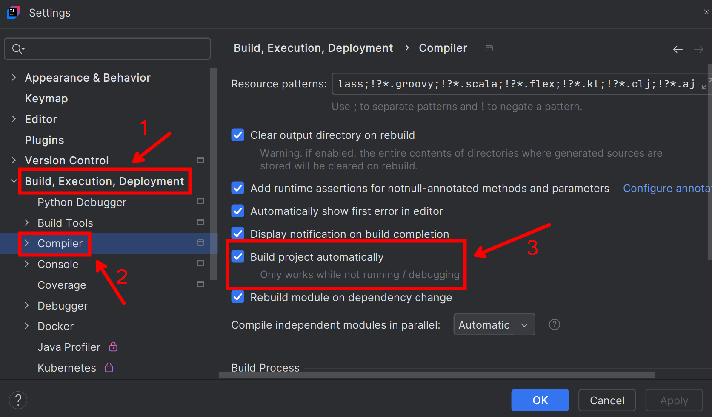
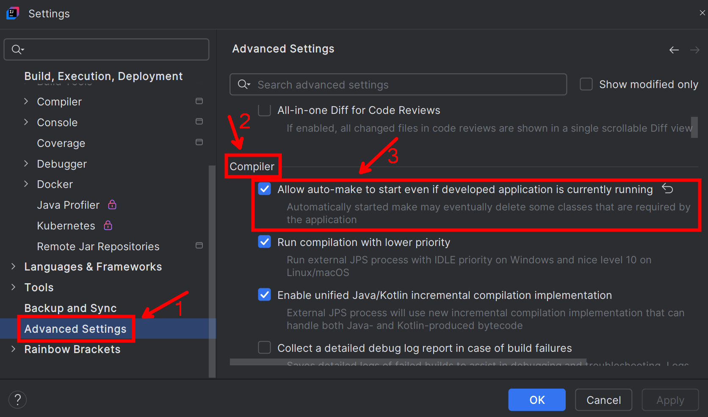
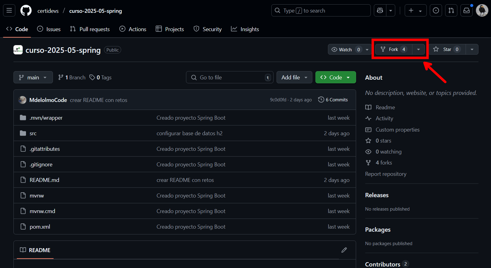
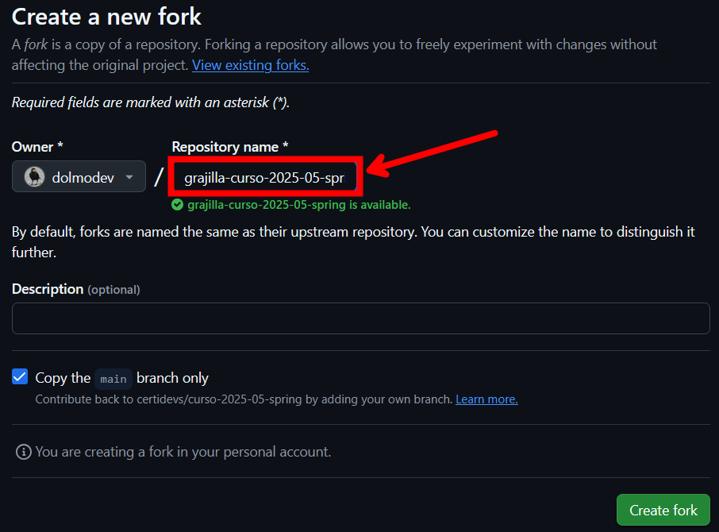
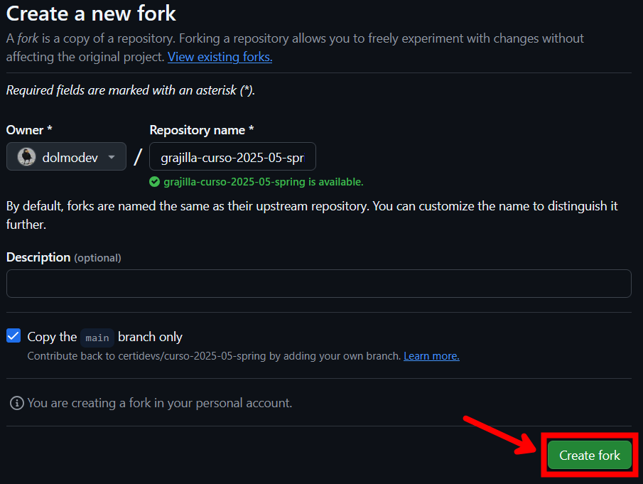
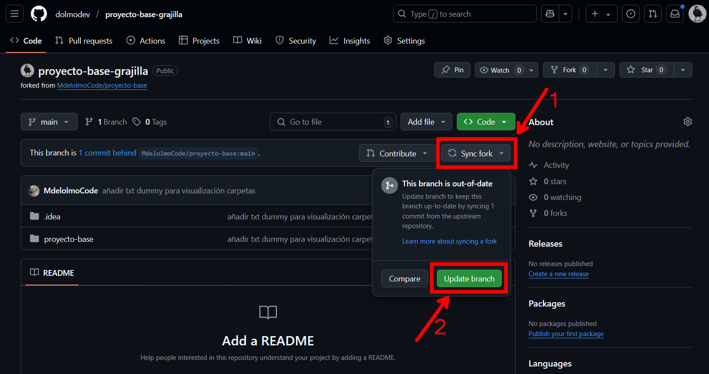

## RETOS

- Crear entidad Asignatura: https://app.certidevs.com/code-exam/e6a0c6d9-b18b-4e9b-a70c-5931164f9cfa
- Entidad y repositorio: https://app.certidevs.com/code-exam/56db9c44-e4f1-4732-abe8-a0dc6e7c0da8
- Métodos derivados y consultas JPQL en repositorios: https://app.certidevs.com/code-exam/912a460d-1c7b-431c-9d9d-9659fed166d2
- Relación ManyToOne con Tarea y Proyecto: https://app.certidevs.com/project-exam/0ddc1351-0c41-4f79-a98b-2b5ca2080529
- Controller de Categoria: https://app.certidevs.com/code-exam/ca2249e8-c2f8-412b-aabe-cc4b3a4a1166

## PROYECTO VACÍO
Hacer fork al proyecto y clonar desde TU cuenta (no la de MdelOlmoCode): https://github.com/MdelolmoCode/proyecto-base


## TRADUCCIONES

- `Entity` -> Entidad
- `Repository` -> Repositorio
- `GeneratedValue` -> Valor generado
- `IDENTITY` -> Identidad

- `new` -> Nuevo

- `Table` -> Tabla
- `name` -> Nombre

- `OneToOne` -> Uno a uno
- `OneToMany` -> Uno a muchos
- `ManyToOne` -> Muchos a uno
- `ManyToMany` -> Muchos a muchos

- `Is` -> Es (por defecto)
- `Like` -> Como (parecido a)
- `NotLike` -> No como (no parecido a)
- `StartsWith` -> Empieza con
- `EndsWith` -> Acaba con
- `Empty` -> Vacío
- `NotEmpty` -> No vacío
- `True` -> Verdadero
- `False` -> Falso
- `Contains` -> Contiene
- `NotContains` -> No contiene
- `Between` -> Entre
- `LessThan` -> Menor que/Menos que
- `LessThanEqual` -> Menor o igual que/Menos o igual que
- `GreaterThan` -> Mayor que/Más que
- `GreaterThanEqual` -> Mayor o igual que/Más o igual que
- `After` -> Después
- `Before` -> Antes
- `In` -> En
- `NotIn` -> No en
- `Not` -> No
- `Null` -> Nulo (null)
- `NotNull` -> No nulo (no null)

- `table` -> tabla/mesa
- `head` -> cabeza
- `header` -> header
- `row` -> fila
- `body` -> cuerpo


### Spring Boot Devtools
Permitir reinicios rápidos y automáticos cuando se hacen cambios en la aplicación.

Marcas las siguientes opciones:

1. `Settings` > `Build, Execution, Deployment > Compiler` > `Build project automatically`
    
2. `Settings` > `Advanced Settings` > `Compiler` > `Allow auto-make to start even if developed application is currently running`
    
3. Agregar dependencia Spring Boot Devtools al `pom.xml`:
    ```xml
    <dependency>
        <groupId>org.springframework.boot</groupId>
        <artifactId>spring-boot-devtools</artifactId>
        <scope>runtime</scope>
        <optional>true</optional>
    </dependency>
    ```
4. Agregar línea a `application.properties`:
  `spring.thymeleaf.cache=false`


### Cómo hacer un fork del proyecto

Un fork es una copia del repositorio que yo puedo editar y subir cambios (porque es mi repositorio).

Pasos para hacer un fork:

1. Entrar en https://github.com/ con mi cuenta
2. Ir al repositorio del que quiero hacer fork: https://github.com/certidevs/curso-2025-05-spring
3. Pulsar el botón "Fork" (en línea con el nombre del repositorio)

4. Nombrar al repositorio como queramos. Se recomienda modificar el nombre para evitar confusiones con el repositorio original

5. Pulsar el botón "Create fork"

6. Copiar la nueva url desde tu cuenta y clonar el proyecto en el IDE que se quiera


## Cómo actualizar un fork

1. En github.com, entrar en tu repositorio forkeado
2. Actualizar el repositorio dándole `Sync fork` y a `Update branch`

3. Actualizar proyecto con un Pull dándole a `Update Project` en Intellij IDEA